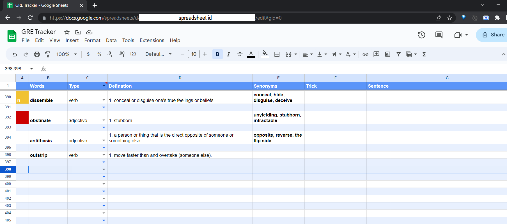
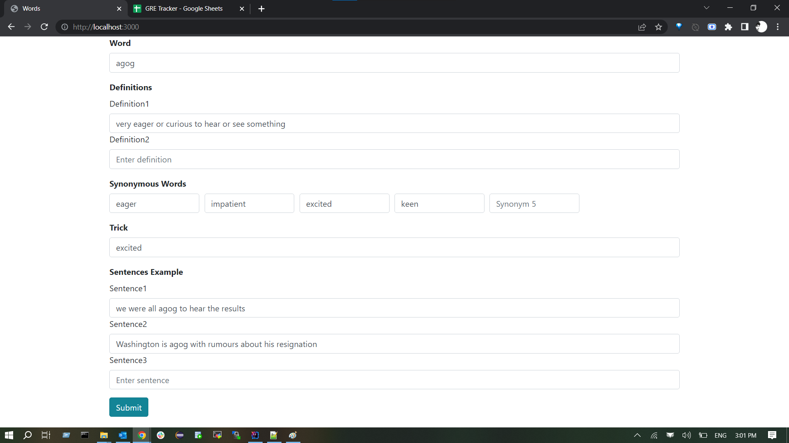
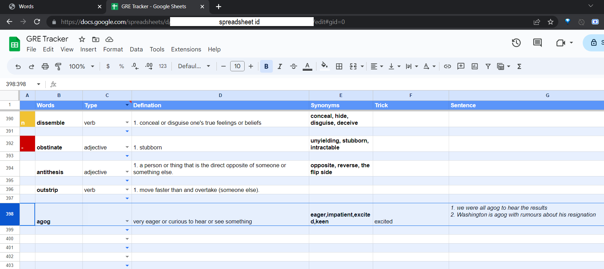

# GRE-Vocab-Google-Spreadsheet-App
A web application to store the form data into the Google Sheets. The current usecase captures the GRE Vocab words along with its definition and synonyms and POST it into the Sheets using Google Sheets REST API.

# How to Setup and Run
1. Create a Google spreadsheet and paste the **spreadsheetId** in application.yml file.
2. Enable Google Sheets API via Google API Console
3. Create an OAuth Client ID and add any authorized redirect URI (for example: http://localhost:8888/Callback)
4. Save the Client ID and download the credentials json file. Copy the contents of this json file into src/main/resources folder , with the file named **credentials.json** (mentioned in application.yml file)
5. Execute the SpringBoot application and open **http://localhost:3000**

# Screenshots

1. Spreadsheet Before

2. Web application with values filled. *Note: You can add multiple synonyms, sentences and definition for a particular Word)*

3. Spreadsheet After
